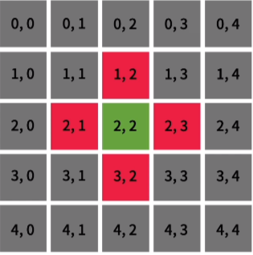
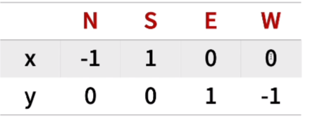

# 1. 방향 벡터

## 1.1 대표적인 문제

- BFS
- DFS
- 이러한 문제들은 대부분 **2/3차원 배열**에서 이루어 진다.

<br/>

## 1.2 탐색/확인 방향

1. 상하좌우
2. 상하좌우, 대각선
3. 나이트/말 (2칸 1칸)

<br/>

### 1.2.1 상하좌우

**1) 기본적인 방법**



```python
if way == 'N': # 상
    x -= 1
elif way == 'S': # 하
    x += 1
elif way == 'E': # 우
    y += 1
else: # 좌
    y -= 1
```

<br/>

**2) 심화 방법**

```python
if way == 'N': # 상
    x += -1
    y += 0
elif way == 'S': # 하
    x += 1
    y += 0
elif way == 'E': # 우
    x += 0
    y += 1
else: # 좌
    x += 0
    y += -1
```



```python
dx = [-1, 1, 0, 0]
dy = [0, 0, -1, 1]
```

<br/>

**3) 심화 방법의 다양한 표현**

```python
# 쓰기 편한 방법
dx = [-1, 1, 0, 0]
dy = [0, 0, -1, 1]

# 반시계 방향 (동 > 북 > 서 > 남)
dx = [0, -1, 0, 1]
dy = [1, 0, -1, 0]

# 시계 방향 (동 > 남 > 서 > 북)
dx = [0, 1, 0, -1]
dy = [1, 0, -1, 0]
```

<br/>

**4) tuple을 활용한 선언**

```python
dx, dy = [0, -1, 0, 1], [1, 0, -1, 0] # 반시계 방향
```

<br/>

## 1.3 활용 방법

```python
# 개선전
if way == 'N': # 상
    x -= 1
elif way == 'S': # 하
    x += 1
elif way == 'E': # 우
    y += 1
else: # 좌
    y -= 1
```

```python
# 개선후 (ENSW: 동북서남, 반시계 방향)
x += dx['ENSW'.index(way)]
y += dy['ENSW'.index(way)]
```

<br/>

## 1.4 DFS에서의 활용 방법

```python
for i in range(4):
    dfs(x+dx[i], y+dy[i])
```