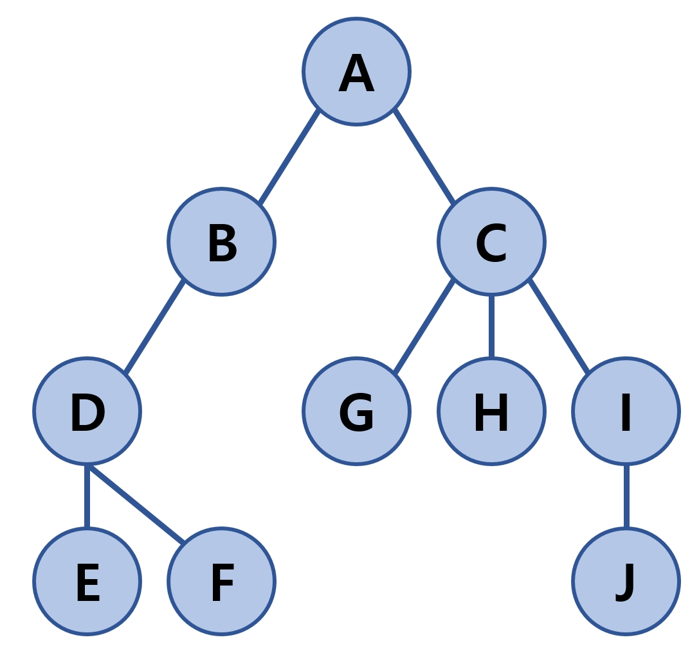
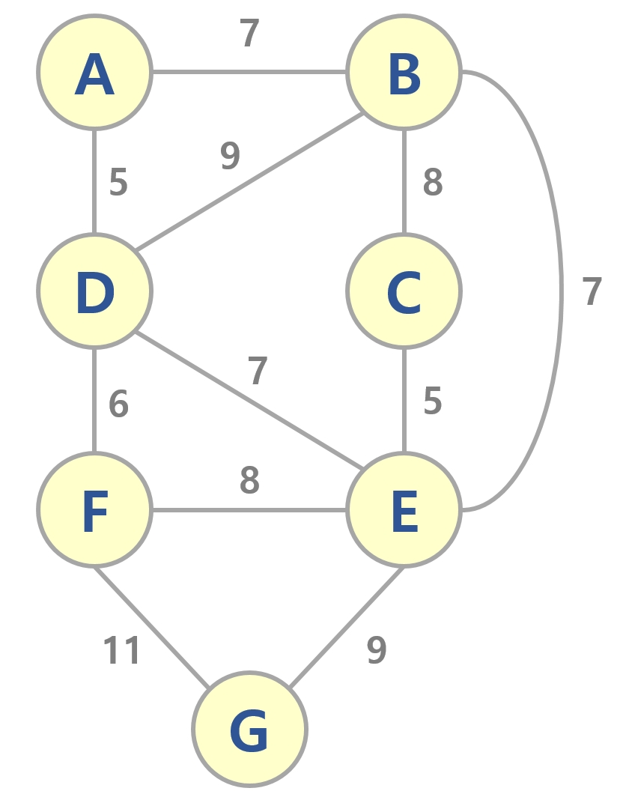

# 탐색 알고리즘 특징 비교

| 구분1  | 구분2 | 탐색 알고리즘                                         | 특징                                                         | 시간 복잡도  |
| :----: | :---: | :---------------------------------------------------- | ------------------------------------------------------------ | ------------ |
|   -    | 기본  | 순차 탐색<br />(Sequential Search)                    | - 리스트를 앞에서 부터 하나씩 비교해서 찾음                  | $O(n)$       |
|   -    | 기본  | 이진 탐색<br />(Binary Search)                        | - 데이터 정렬<br />- 데이터를 중간값 기준으로 2개의 서브 리스트로 분리<br />- 데이터의 중간 위치가 찾고자 하는 값과 크기 비교<br />- 중간값 위치가 더 크면 왼쪽 서브 리스트를 사용해 위 과정 반복<br />- 중간값 위치가 더 작으면 오른쪽 서브 리스트를 사용해 위 과정 반복 | $O(log n)$   |
| 그래프 | 기본  | 너비 우선 탐색<br />(Breadth First Search, BFS)       | - 한 단계씩 내려가면서, 해당 노드와 같은 레벨에 있는 노드(형제 노드)들을 먼저 순회<br />- **2개의 큐(`need_visit`, `visited`)를 이용해 구현**<br />- $V$ : 노드의 수<br />- $E$ : 간선의 수 | $O(V+E)$     |
| 그래프 | 기본  | 깊이 우선 탐색<br />(Depth First Search, DFS)         | - 한 노드의 자식을 타고 끝까지 순회<br />- 다시 돌아와서 다른 형제들의 자식을 타고 내려가면서 순회<br />- **1개의 스택(`need_visit`)과 1개의 큐(`visited`)를 이용해 구현**<br />- $V$ : 노드의 수<br />- $E$ : 간선의 수 | $O(V + E)$   |
| 그래프 | 고급  | 다익스트라 알고리즘<br />(Dijkstra Algorithm)         | - **최단 경로 탐색** 알고리즘 (단일 출발 최단 경로 문제)<br />- 첫 정점을 기준으로 연결되어 있는 정점들을 추가해 가며 최단 거리 갱신<br />- BFS와 유사<br />- 우선순위 큐 활용(`MinHeap`) | $O(E log E)$ |
| 그래프 | 고급  | 크루스칼 알고리즘<br />(Kruskal's Algorithm)          | - **최소 신장 트리(MST) 탐색** 알고리즘 <br />- 모든 정점을 독립적인 집합으로 만듬<br />- 모든 간선을 비용 기준으로 정렬<br />- 비용이 적은 간선부터 양 끝 두 정점을 비교<br />- 두 정점의 최상위 정점을 확인하고, 서로 다를 경우 두 정점을 연결 (사이클 발생 제한) | $O(E log E)$ |
| 그래프 | 고급  | Union-Find 알고리즘                                   | - **크루스칼 알고리즘에서 사이클 존재유무를 판별**하는 데 사용되는 알고리즘<br />- 현재까지 간선이 연결된 노드들을 집합으로 지정<br />- 간선이 연결되지 않은 노드들을 또 다른 집합으로 지정<br />- 새로운 간선을 통해 노드 연결 시,  연결되는 노드가 간선이 연결된 노드들의 집합에 포함된 노드라면 사이클이 발생한다고 판단<br />- **path compression** : 루트 노드 찾는데 사용되는 기법<br />- **union-by-rank** : 두 트리를 union하는 데 사용되는 기법 | $O(E)$       |
| 그래프 | 고급  | 프림 알고리즘<br />(Prim's Algorithm)                 | - **최소 신장 트리(MST) 탐색** 알고리즘<br />- 시작 정점을 선택 후 "연결된 노드 집합"에 삽입<br />- 선택된 정점에 연결된 간선들을 "간선 리스트"에 삽입<br />- "간선 리스트"에서 최소 가중치를 가지는 간선부터 추출(최소힙 활용)<br />- 해당 간선에 연결된 정점이 "연결된 노드 집합"에 포함된 경우<br />  - 스킵 (사이클 방지)<br />- 해당 간선에 연결된 정점이 "연결된 노드 집합"에 포함되지 않은 경우<br />  - 해당 간선 선택 및 해당 간선 정보를 "최소 신장 트리"에 삽입<br />- 해당 간선에 연결된 인접 정점의 간선들 중, "연결된 노드 집합"에 없는 노드와 연결된 간선들만 "간선 리스트"에 삽입<br />- 선택된 간선은 "간선 리스트"에서 제거<br />- "간선 리스트"에 더 이상의 간선이 없을 때까지 과정 반복 | $O(E log E)$ |
| 그래프 | 고급  | 개선된 프림 알고리즘<br />(Advanced Prim's Algorithm) | - **최소 신장 트리(MST) 탐색** 알고리즘<br />- 프림 알고리즘과 다르게 간선이 아닌 노드를 중심으로 우선순위 큐를 적용하는 방식<br />- **초기화**<br />  - `정점:key` 구조 생성<br />  - 특정 정점 선택하여 해당 정점은 key값을 `0`으로 지정<br />  - 나머지 정점의 key값을 `inf`로 지정<br />  - 모든 `정점:key`를 우선순위 큐에 삽입<br />- **extract min**<br />  - 우선순위 큐에서 가장 key값이 작은 정점 추출(`pop`)<br />- **decrease key**<br />  - 우선순위 큐에서 추출된 정점에 인접한 정점들에 대해 key값과 연결된 가중치값 비교<br />  - 연결된 가중치값이 key값보다 작으면 해당 `정점:key`의 key값을 연결된 가중치값으로 갱신<br />  - 해당 정점 및 연결된 가중치 정보를 최소 신장 트리에 삽입<br />  - `정점:key` 갱신 시, 우선순위 큐는 최소 key값을 가지는 `정점:key`를 루트 노드로 올려놓도록 재구성 (`heapdict`을 활용하여 구현 가능)<br />- 우선순위 큐에 데이터가 없을 때 까지 **extract min**과 **decrease key** 반복 | $O(E log V)$ |

<br>

# (탐색 전략) 탐욕 알고리즘 (Greedy Algorithm)

## 특징

- 최적의 해에 가까운 값을 구하기 위해 사용됨
- 여러 경우 중 하나를 결정해야 할 때마다 **매 순간 최적이라고 생각되는 경우를 선택**하는 방식으로 진행되는 알고리즘

<br>

## 탐욕 알고리즘의 예

### 예시 1 : 동전 문제

- 가장 큰 동전 순서대로 정렬

```python
def min_coin_count(value, coin_list):
    total_coin_count = 0
    details = list()
    coin_list.sort(reverse=True)
    for coin in coin_list:
        coin_num = value // coin
        total_coin_count += coin_num
        value -= coin_num * coin
        details.append([coin, coin_num])
    return total_coin_count, details

coin_list = [500, 100, 50, 1]
min_coin_count(4720, coin_list)
```

```
(31, [[500, 9], [100, 2], [50, 0], [1, 20]])
```


<br>

### 예시 2 : 부분 배낭 문제 (Fractional Knapsack Problem)

- 무게대비 가치(가치(v) / 무게(w))가 큰 순서대로 정렬

```python
def get_max_value(data_list, capacity):
    data_list = sorted(data_list, key=lambda x: x[1] / x[0], reverse=True)
    total_value = 0
    details = list()
    
    for data in data_list:
        if capacity - data[0] >= 0:
            capacity -= data[0]
            total_value += data[1]
            details.append([data[0], data[1], 1])
        else:
            fraction = capacity / data[0]
            total_value += data[1] * fraction
            details.append([data[0], data[1], fraction])
            break
    return total_value, details

data_list = [(10, 10), (15, 12), (20, 10), (25, 8), (30, 5)]
get_max_value(data_list, 30)
```

```
(24.5, [[10, 10, 1], [15, 12, 1], [20, 10, 0.25]])
```


<br>

# 탐색 알고리즘 구현

## 순차 탐색 (Sequential Search) 구현

```python
def sequential(data_list, search_data):
    for index in range(len(data_list)):
        if data_list[index] == search_data:
            return index
    return -1
```

<br>

## 이진 탐색 (Binary Search) 구현

```python
def binary_search(data, search):
    print(data)
    if len(data) == 1 and search == data[0]:
        return True
    if len(data) == 1 and search != data[0]:
        return False
    if len(data) == 0:
        return False
    
    medium = len(data) // 2
    if search == data[medium]:
        return True
    else:
        if search > data[medium]:
            return binary_search(data[medium+1:], search)
        else:
            return binary_search(data[:medium], search)
```

<br>

## 그래프 표현



```python
graph = dict()

graph['A'] = ['B', 'C']
graph['B'] = ['A', 'D']
graph['C'] = ['A', 'G', 'H', 'I']
graph['D'] = ['B', 'E', 'F']
graph['E'] = ['D']
graph['F'] = ['D']
graph['G'] = ['C']
graph['H'] = ['C']
graph['I'] = ['C', 'J']
graph['J'] = ['I']
```

<br>

## 너비 우선 탐색 (Breadth First Search, BFS) 구현

```python
def bfs(graph, start_node):
    need_visit, visited = list(), list()
    need_visit.append(start_node)
    while need_visit:
        node = need_visit.pop(0) # FIFO
        if node not in visited:
            visited.append(node)
            need_visit.extend(graph[node])
    return visited
```

<br>

## 깊이 우선 탐색 (Depth First Search, DFS) 구현

```python
def dfs(graph, start_node):
    need_visit, visited = list(), list()
    need_visit.append(start_node)
    whlie need_visit:
        node = need_visit.pop() # LIFO
        if node not in visited:
            visited.append(node)
            need_visit.extend(graph[node])
    return visited
```

<br>

# 최단 경로 탐색 알고리즘

## 다익스트라 알고리즘 (Dijkstra Algorithm) 구현

```python
mygraph = {
    'A': {'B': 8, 'C': 1, 'D': 2},
    'B': {},
    'C': {'B': 5, 'D': 2},
    'D': {'E': 3, 'F': 5},
    'E': {'F': 1},
    'F': {'A': 5}
}

import heapq

def dijkstra(graph, start):
    distances = {node: float('inf') for node in graph}
    distances[start] = 0
    queue = []
    heapq.heappush(queue, [distances[start], start]) # [0, start]
    
    while queue:
        current_distance, current_node = heapq.heappop(queue) # [0, start] pop
        
        if distances[current_node] < current_distance:
            continue
        
        for adjacent, weight in graph[current_node].items():
            distance = current_distance + weight
            
            if distance < distances[adjacent]:
                distances[adjacent] = distance
                heapq.heappush(queue, [distance, adjacent])
                
    return distances
```

<br>

# 최소 신장 트리(MST) 구현 알고리즘

## 크루스칼 알고리즘(Kruskal's Algorithm) 구현



```python
mygraph = {
    'vertices': ['A', 'B', 'C', 'D', 'E', 'F', 'G'], # 노드의 종류
    'edges': [ # 간선들
        (7, 'A', 'B'), # (weight, 왼쪽 끝점, 오른쪽 끝점)
        (5, 'A', 'D'),
        (7, 'B', 'A'),
        (8, 'B', 'C'),
        (9, 'B', 'D'),
        (7, 'B', 'E'),
        (8, 'C', 'B'),
        (5, 'C', 'E'),
        (5, 'D', 'A'),
        (9, 'D', 'B'),
        (7, 'D', 'E'),
        (6, 'D', 'F'),
        (7, 'E', 'B'),
        (5, 'E', 'C'),
        (7, 'E', 'D'),
        (8, 'E', 'F'),
        (9, 'E', 'G'),
        (6, 'F', 'D'),
        (8, 'F', 'E'),
        (11, 'F', 'G'),
        (9, 'G', 'E'),
        (11, 'G', 'F')
    ]
}

# 0. 2가지의 사전 구조체 생성
parent = dict() # 각각의 노드의 부모 노드 값을 저장
rank = dict() # 각각의 노드의 높이(rank)값을 저장

def find(node):
    # 3.1.1 해당 노드의 루트 노드를 찾는 함수
    # - path compression 기법 활용
    if parent[node] != node: # 자신의 부모 노드가 자신과 다른 지 확인 (같으면 루트 노드)
        parent[node] = find(parent[node]) # recursive, 자기 자신 노드의 부모 노드 찾기
    return parent[node] # 루트 노드 return
    # -> path compression 기법으로 인해 해당 노드의 루트 노드 정보가 parent에 저장된다.
    
def union(node_v, node_u):
    # 3.1.2 두 노드를 union 하는 함수
    # - union-by-rank 기법 활용
    #  - 루트 노드의 rank를 알아 냄
    #  - rank가 높은 쪽으로 rank가 낮은 트리를 연결
    #  - 두 트리의 rank가 같은 경우, 한 쪽의 rank를 1 상승 시킴
    
    # 3.1.2.1 각 노드의 루트 노드 찾기
    root1 = find(node_v)
    root2 = find(node_u)
    
    # 3.1.2.2 각 노드의 루트 노드의 rank 찾기
    if rank[root1] > rank[root2]: # root1의 rank가 root2의 rank보다 클 경우
        # rank가 작은 root2를 root1에 연결
        parent[root2] = root1
    else: # root2의 rank가 root1의 rank보다 클 경우
        # rank가 작은 root1를 root2에 연결
        parent[root1] = root2
        if rank[root1] == rank[root2]: # root1과 root2의 rank가 같은 경우
            rank[root2] += 1 # 한 쪽 루트 노드의 rank를 1 상승 시킨다.
    

def make_set(node):
    # 1.1 각각의 노드들을 개별적인 부분 집합으로 만듬
    # 1.1.1 각각의 노드의 부모를 자기 자신으로
    parent[node] = node
    # 1.1.2 각각의 노드의 높이를 0으로
    rank[node] = 0

def kruskal(graph):
    
    mst = list()
    
    # 1. 각 노드별 부분 집합 만들기 (초기화)
    for node in graph['vertices']:
        make_set(node)
        
    # 2. 정렬 (간선 weight 기반)
    edges = graph['edges']
    edges.sort() # 2.1 간선을 가중치 크기순으로 정렬 (파이썬 리스트 sort() 함수 사용)
    # -> 퀵소트를 직접 구현하여 정렬할 수도 있다.
    
    # 3. 간선 연결
    # - 사이클이 있는 지 먼저 확인
    # - weight가 낮은 것부터 꺼냄
    for edge in edges:
        weight, node_v, node_u = edge # 튜플 자료 구조 특성 활용
        
        # 3.1 사이클 확인
        if find(node_v) != find(node_u): # 3.1.1 루트 노드가 다른 지 확인
            # 3.1.2 다르다면 union 실시
            union(node_v, node_u)
            
            # 3.1.3 union 되었으므로 해당 간선은 최소 신장 트리의 한 부분이 된다.
            mst.append(edge)
    
    return mst
```

<br>

## 프림 알고리즘(Prim's Algorithm) 구현

```python
myedges = [ # 중복된 간선들은 제외
    (7, 'A', 'B'), (5, 'A', 'D'),
    (8, 'B', 'C'), (9, 'B', 'D'), (7, 'B', 'E'),
    (5, 'C', 'E'),
    (7, 'D', 'E'), (6, 'D', 'F'),
    (8, 'E', 'F'), (9, 'E', 'G'),
    (11, 'F', 'G')
]

from collections import defaultdict
from heapq import * 

def prim(start_node, edges):
    
    # 최소 신장 트리 간선 리스트들을 저장할 변수 생성
    mst = list()
    
    # 각각의 노드들을 key로 갖는 dict 생성
    # 해당 노드에 연결된 간선 리스트를 value로 가짐
    # defaultdict을 사용했으므로 각각의 key들을 모두 초기화해 줄 필요 없음
    # 특정 노드를 key값으로 입력하면 해당 노드와 연결된 모든 간선 리스트들이 반환됨
    adjacent_edges = defaultdict(list)
    
    # 각 노드별 간선 정보들을 adjacent_edges에 저장
    for edge in edges:
        weight, n1, n2 = edge
        adjacent_edges[n1].append((weight, n1, n2))
        adjacent_edges[n2].append((weight, n2, n1))
        
    # 임의의 정점(start_node)를 선택
    # 선택된 정점을 연결된 노드 집합(connected_nodes)에 저장
    connected_nodes = set(start_node)
    
    # 선택된 정점에 연결된 간선들(리스트 형태)을 간선 리스트(candidate_edge_list)에 저장
    candidate_edge_list = adjacent_edges[start_node]
    
    # heapify를 이용하여 간선 리스트에 포함된 모든 간선들을 가중치 순으로 정렬
    # 간선 리스트를 최소힙(MinHeap) 구조로 변경하는 과정
    heapify(candidate_edge_list)
    
    # while문을 활용해 더 이상 간선이 없을 때 까지 반복
    while candidate_edge_list:
        
        # 간선 리스트(candidate_edge_list)에서 최소 가중치를 갖는 간선부터 추출
        # n1 : 원래의 정점
        # n2 : 원래의 정점과 간선으로 연결된 인접 정점
        weight, n1, n2 = heappop(candidate_edge_list)
        
        # 해당 간선에 연결된 인접 정점(n2)이 연결된 노드 집합(connected_nodes)에 들어 있지 않은 경우
        # 사이클 발생 방지
        if n2 not in connected_nodes:
            
            # 연결된 노드 집합(connected_nodes)에 인접 정점(n2) 삽입
            connected_nodes.add(n2)
            
            # 최소 신장 트리에 해당 간선 정보 삽입
            mst.append((weight, n1, n2))
            
            # 인점 정점에 연결된 모든 간선들 탐색
            for edge in adjacent_edges[n2]:
                
                # 인점 정점에 연결된 모든 간선들에 연결된 인접 정점이
                # 연결된 노드 집합(connected_nodes)에 들어 있지 않은 경우
                if edge[2] not in connected_nodes:
                    
                    # 간선 리스트(candidate_edge_list)에 해당 간선들을 삽입
                    heappush(candidate_edge_list, edge)
                    
                    # 연결된 노드 집합(connected_nodes)에 없는 노드와 연결된 간선들만 간선 리스트에 삽입함으로서
                    # 어차피 스킵될 간선들을 간선 리스트에 삽입되는 것을 방지함
    
    return mst
```

<br>

## 개선된 프림 알고리즘(Advanced Prim's Algorithm) 구현

```python
mygraph = {
    'A': {'B': 7, 'D': 5}, # A-B의 가중치 = 7, A-D의 가중치 = 5
    'B': {'A': 7, 'D': 9, 'C': 8, 'E': 7},
    'C': {'B': 8, 'E': 5},
    'D': {'A': 5, 'B': 9, 'E': 7, 'F': 6},
    'E': {'B': 7, 'C': 5, 'D': 7, 'F': 8, 'G': 9},
    'F': {'D': 6, 'E': 8, 'G': 11},
    'G': {'E': 9, 'F': 11}    
}

from heapdict import heapdict

def prim(graph, start):
    # 최소 신장 트리 저장 변수
    mst = list()
    
    # "노드:key" 구조를 가진 우선순위 큐(최소힙) 생성
    keys = heapdict()
    
    # 특정 노드의 key값 갱신 시, 
    # 어떤 노드와 연결된 가중치가 key값으로 갱신되는 지에 대한 정보를 저장
    # ex) pi["B"] = "A" : B 노드의 key값은 A 노드와 연결된 간선의 가중치 값으로 갱신된다.
    pi = dict()
    
    # 프림 알고리즘의 목표 : 최소 가중치 구하기
    # 최소 가중치를 나타내는 총 가중치를 저장하는 변수
    total_weight = 0
    
    # 그래프에 있는 모든 노드들 추출
    for node in graph.keys():
         # 모든 노드의 key값을 inf로 지정
        keys[node] = float('inf')
        pi[node] = None
    
    # 현재 선택된 임의 노드(start)의 key값을 0으로 지정
    keys[start] = 0
    pi[start] = start
    
    # 우선순위 큐에 데이터가 없을 때 까지 반복
    while keys:
        # heapdict에서 데이터를 추출할 때는 popitem() 함수 사용
        current_node, current_key = keys.popitem()
        
        # 최소 신장 트리에 해당 간선 정보 삽입
        mst.append([pi[current_node], current_node, current_key])
        
        # 가중치 갱신
        total_weight += current_key
        
        # 현재 노드에 연결된 노드들 추출
        for adjacent, weight in graph[current_node].items():
            # 연결된 노드가 선택되지 않은 노드이고,
            # 해당 노드의 key값보다 현재 노드와 해당 노드가 연결된 간선의 가중치 값이 더 작은 경우
            if adjacent in keys and weight < keys[adjacent]:
                # key값을 간선의 가중치로 갱신
                keys[adjacent] = weight
                pi[adjacent] = current_node
                
    return mst, total_weight
```

